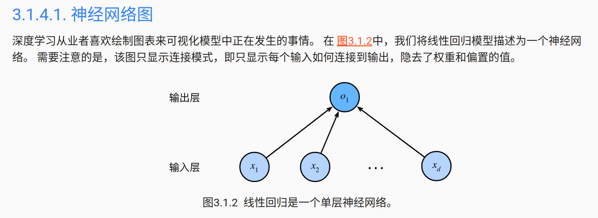
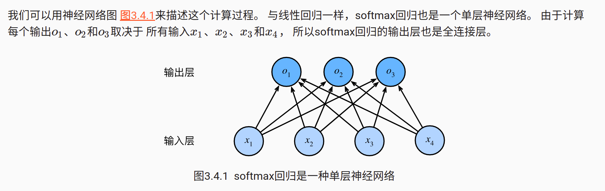
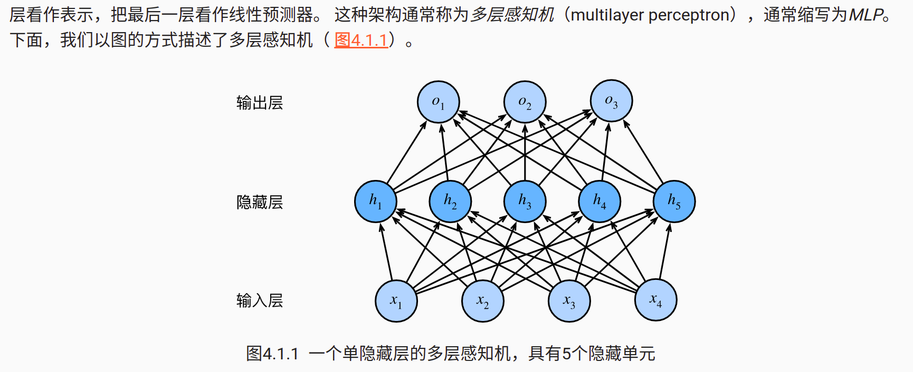

== 线性回归
 

y = w^T^x + b

== Softmax 回归
 

o = Wx + b

* softmax运算获取一个向量并将其映射为概率。

* softmax回归适用于分类问题，它使用了softmax运算中输出类别的概率分布。

* 交叉熵是一个衡量两个概率分布之间差异的很好的度量，它测量给定模型编码数据所需的比特数。

== 多层感知机
 

H = σ(XW^(1)^ + b^(1)^)

O = HW^(2)^ + b^(2)^
