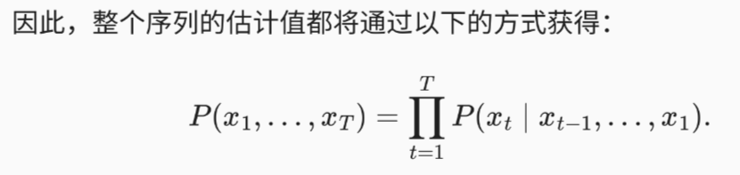

= RNN (循环神经网络)
:toc:

简言之，如果说卷积神经网络可以有效地处理空间信息， 那么本章的循环神经网络（recurrent neural network）则可以更好地处理序列信息。
循环神经网络通过引入状态变量存储过去的信息和当前的输入，从而可以确定当前的输出。

==  序列模型

 

// P(x~t+1~, x~t~, x~t-1~) = P(x~t+1~|x~t~)P(x~t~|x~t-1~)P(x~t-1~|x~t-2~)

自回归模型和隐变量模型

== 文本预处理

将文本转换为数字索引序列，方便模型操作

为了对文本进行预处理，我们通常将文本拆分为词元，构建词表将词元字符串映射为数字索引，并将文本数据转换为词元索引以供模型操作。

== 语言模型和数据集

TODO

== 循环神经网络

_循环神经网络_（recurrent neural networks，RNNs） 是具有隐状态(hidden state)的神经网络。

