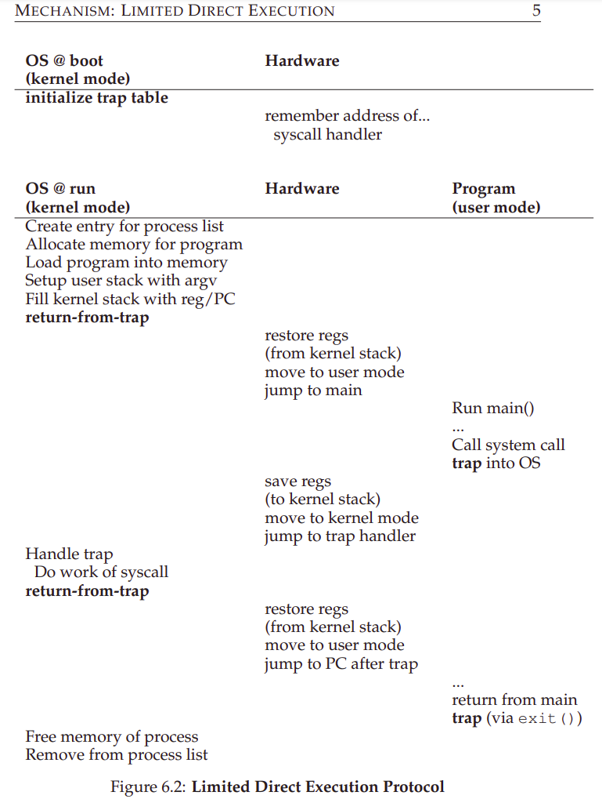
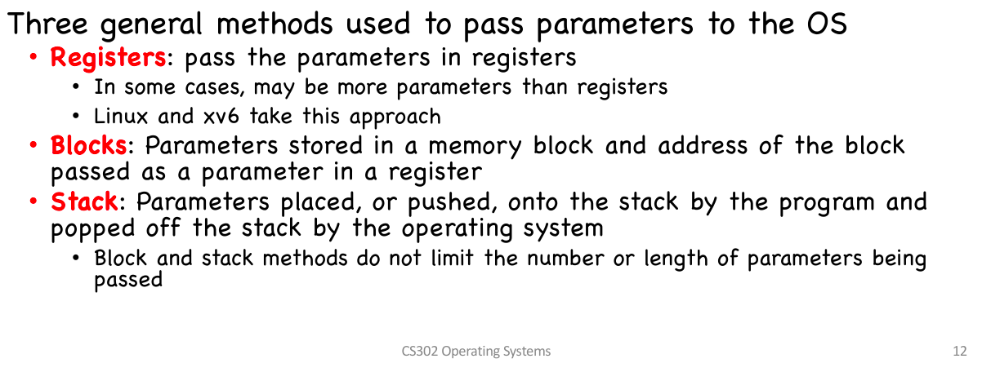
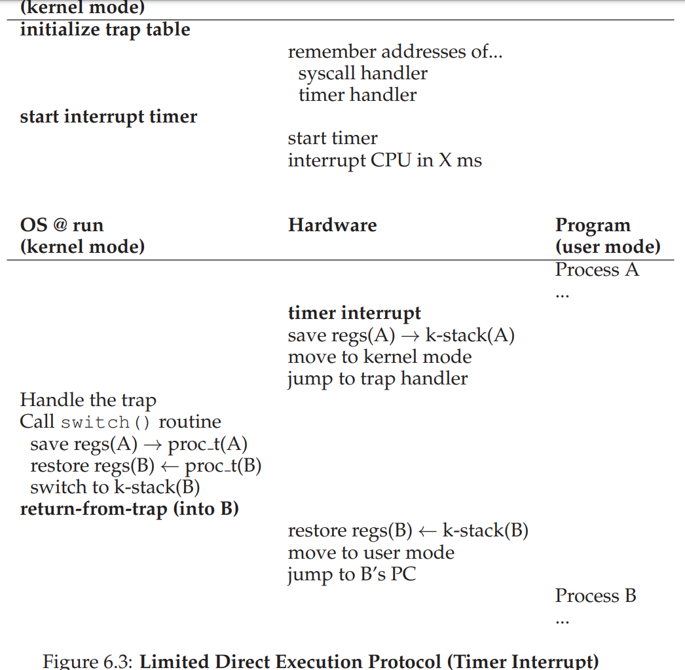
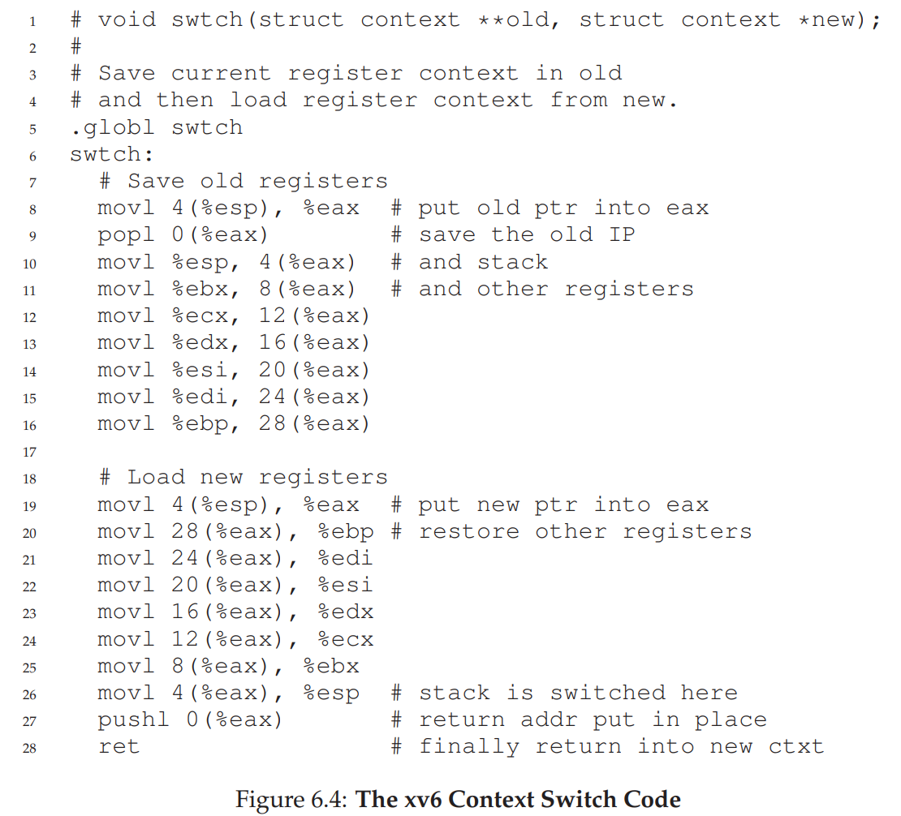

= Mechanism: Limited Direct Execution

By time sharing the CPU, virtualization is achieved.

.THE CRUX: HOW TO EFFICIENTLY VIRTUALIZE THE CPU WITH CONTROL]
____
The OS must virtualize the CPU in an efficient manner while retaining control over the system.
To do so, both hardware and *operating-system support* will be required.
The OS will often use a judicious bit of *hardware support* in order to accomplish its work effectively.
____

== Problem #1: Restricted Operations

.THE CRUX: HOW TO PERFORM RESTRICTED OPERATIONS
____
A process must be able to perform I/O and some other restricted operations, but without giving the process complete control over the system.
How can the OS and hardware work together to do so?
____

.Answer
processor(CPU) mode:: user mode and kernel mode

 

=== System Call

* system call is a procedure call by number

* user code cannot specify an exact address to jump to 

* user code must request a particular service via number

* set up *trap tables* is also a privileged operation

 

==  Problem #2: Switching Between Processes

.THE CRUX: HOW TO REGAIN CONTROL OF THE CPU
____
How can the operating system *regain control* of the CPU so that it can switch between processes?
____

.Answer
*Hardware support*: a timer device raise a *timer interrupt* every other milliseconds

