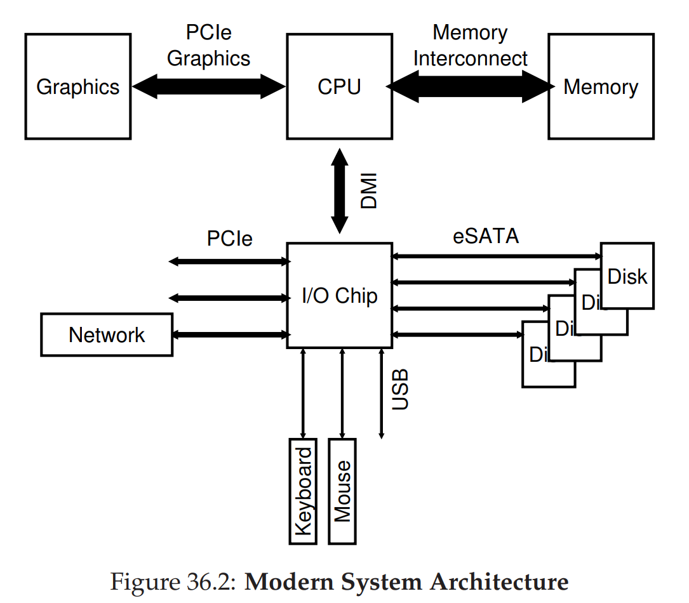
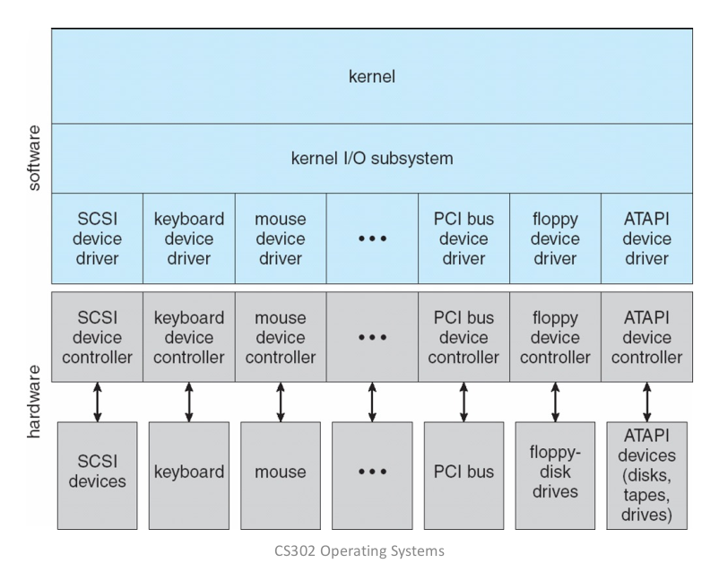

= I/O Devices

[CAUTION]
.THE CRUX: HOW TO INTEGRATE I/O INTO SYSTEMS
====
How should I/O be integrated into systems? What are the general mechanisms?
How can we make them efficient?
====

 

== A Canonical Device
* Interface
** *status* register: current status of the device
** *command* register: send command to perform certain task
** *data* register: exchange data with the device

* Internals
** Micro-controller (CPU)
** Memory (DRAM or SRAM or both)
** Other hardware-specific chips

== DMA
DMA::
Direct Memory Access

A DMA device can transfer data between memory and devices without intervention.

== Device Interaction

[CAUTION]
.THE CRUX: HOW TO COMMUNICATE WITH DEVICES
====
How should the hardware communicate with a device?
Should there be explicit instructions?
Or are there other ways to do it?
====

. explicit *I/O instruction* to send data to specific device registers
. *memory-mapped I/O*: the hardware _routes_ the load/store to the device instead of main memory

== Device Driver

 

device driver:: software used to interact with hardware devices

firmware:: software providing low-level control for a device's hardware
