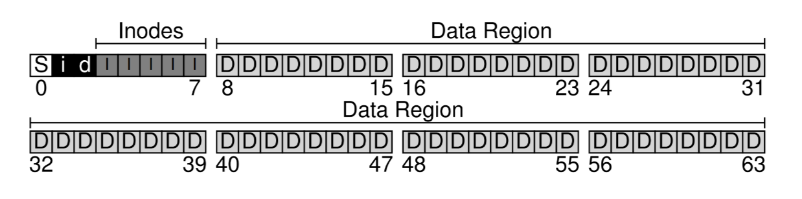

= File System Implementation

The file system is pure software

== VSFS

 

S:: super block
i:: inode bitmap
d:: data bitmap
I:: inode
D:: data

[source,c]
----
struct inode {
    direct pointers
    indirect pointers
}
----

direct pointer:: disk address of one disk block
indirect pointer:: points to a **block** that contains more pointers

