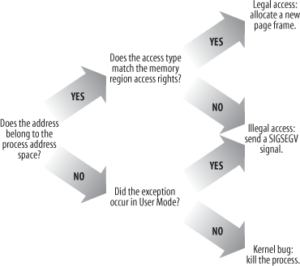

= Beyond Physical Memory: Mechanisms

.THE CRUX: HOW TO GO BEYOND PHYSICAL MEMORY
____
How can the OS make use of a larger, slower device to transparently provide the illusion of a large virtual address space?
____

Page fault::
Access a page not in physical memory (handled by OS page-fault handler)

 