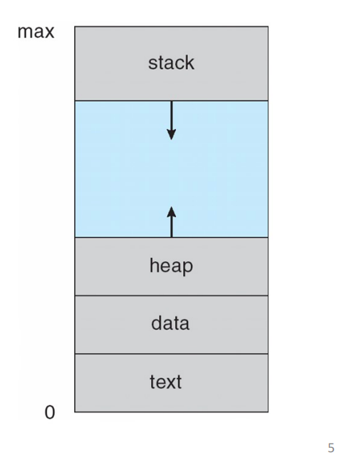
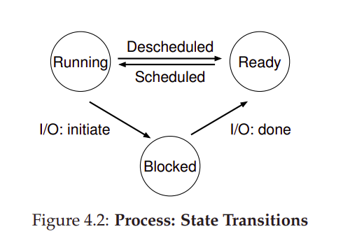
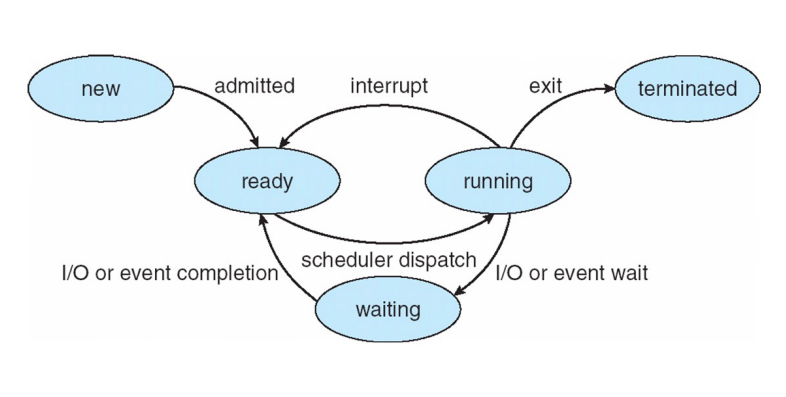

= The Abstraction: A Process

mechanisms:: low-level methods or protocols that implement a needed piece of dunctionality

policies:: high-level algorithms for making some kind of decision within th OS

process:: a running program

machine state:: *address space*, *registers*(pc, sp, fp, ...), *I/O*

 

== Process API

* *Crate*
* *Destroy*
* *Wait*
* *Miscellaneous Control*(suspend, resume, etc)
* *Status*

== Process Creation

* Loading: load code and static data into memory

* Stack: allocate some memory for the program's run-time stack

* Heap: allocate some memory for the program's heap

* File descriptors: standard input, standard output, standard error

* Persistence: ?

== Process States

 

 

== Data Structures

process list:: contains information about all processes in the system

process control block (PCB):: contains information about a specific process

== Process API

• The `fork()` system call is used in UNIX systems to create a new process.
The creator is called the parent; the newly created process is called the child.
As sometimes occurs in real life [J16], the child process is a nearly identical copy of the parent.

• The `wait()` system call allows a parent to wait for its child to complete execution.

• The `exec()` *family* of system calls allows a child to break free from its similarity to its parent and execute an entirely new program.

• *Process control* is available in the form of signals, which can cause jobs to stop, continue, or even terminate
