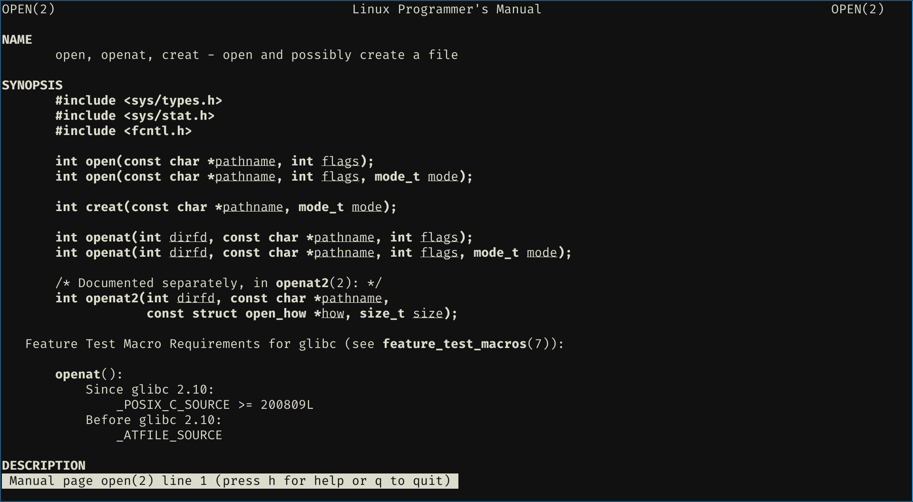

= Interlude: Files and Directories

file:: a linear array of bytes

directory:: maps the user-readable name to the low-level name

each file and directory has a *inode number*

== Creating Files

 

== Reading and Writing Files

