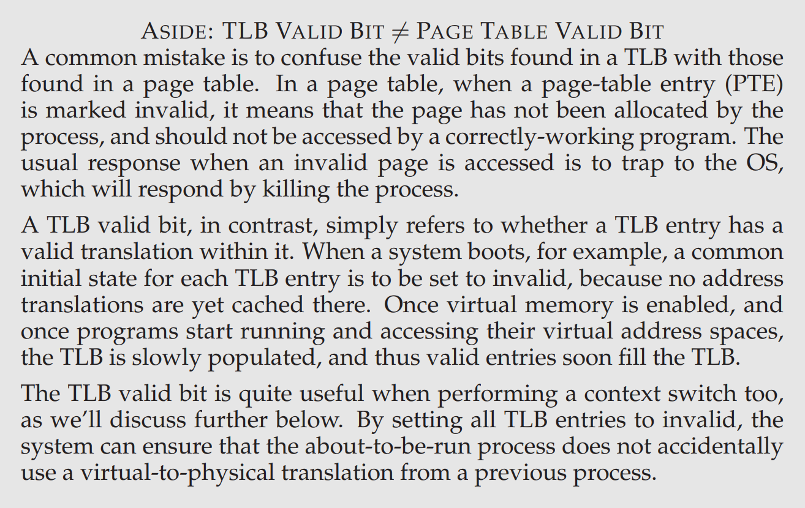

= Paging: Faster Translations (TLBs)

.THE CRUX: HOW TO SPEED UP ADDRESS TRANSLATION
[CAUTION]
====
How can we speed up address translation, and generally avoid the
extra memory reference that paging seems to require? What hardware
support is required? What OS involvement is needed?
====

A TLB  is simply a hardware *cache* of popular virtual-to-physical address translations

.TLB Control Flow Algorithm
[source]
----
1  VPN = (VirtualAddress & VPN_MASK) >> SHIFT
2  (Success, TlbEntry) = TLB_Lookup(VPN)
3  if (Success == True)      // TLB Hit
4      if (CanAccess(TlbEntry.ProtectBits) == True)
5          Offset = VirtualAddress & OFFSET_MASK
6          PhysAddr = (TlbEntry.PFN << SHIFT) | Offset
7          Register = AccessMemory(PhysAddr)
8      else
9          RaiseException(PROTECTION_FAULT)
10 else     // TLB Miss
11     PTEAddr = PTBR + (VPN * sizeof(PTE))
12     PTE = AccessMemory(PTEAddr)
13     if (PTE.Valid == False)
14         RaiseException(SEGMENTATION_FAULT)
15     else if (CanAccess(PTE.ProtectBits) == False)
16         RaiseException(PROTECTION_FAULT)
17     else
18         TLB_Insert(VPN, PTE.PFN, PTE.ProtectBits)
19         RetryInstruction()
----

temporal locality::
an instruction or data item recently accessed will likely be re-accessed soon

spatial locality::
a program accesses memory at address x, it will likely soon access memory near x

 

NOTE: A process's TLB is part of the chip's MMU, however, it could be managed by either hardware or software.

valid bit:: whether the entry has a valid translation or not

protection bit::  determine how a page can be accessed

.On context switch
* *flush* the TLB (sets all valid bits to 0)
* add hardware support: address space identifier (ASID)

.THE CRUX: HOW TO DESIGN TLB REPLACEMENT POLICY
[CAUTION]
====
Which TLB entry should be replaced when we add a new TLB entry?
The goal, of course, being to minimize the miss rate (or increase hit rate) and thus improve performance.
====

